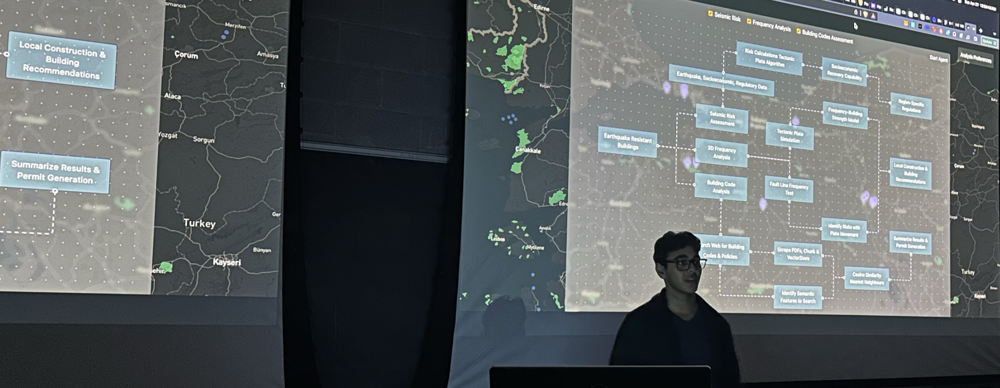

# Shapeshift

Shapeshift is a **machine learning experiment** that aims to optimize the construction of earthquake-resistant buildings in third world countries.

The approach uses novel fourier analysis on earthquake waveforms in three dimensions to model how seismic frequencies decay as a function of distance from its epicentre. The goal was to identify the X, Y and Z frequencies to test a building design with to maximize its earthquake-resistance in a geographical area, at the lowest cost. Using LSTMs and Attention Mechanisms to evaluate risk in geographical regions, we can then construct multi-layer perceptron networks to model the seismic frequencies and propose designs to maximize resistance at the lowest cost.

My work was accelerated by the RippleX Fellowship & RBCx, under the guidance of Dominic Lau & advisors, alongside various micro-grants. I spent my 2023 summer identifying and researching ways to better construct buildings. Recently, I decided to improve previous work, as well as train the models on larger datasets.

